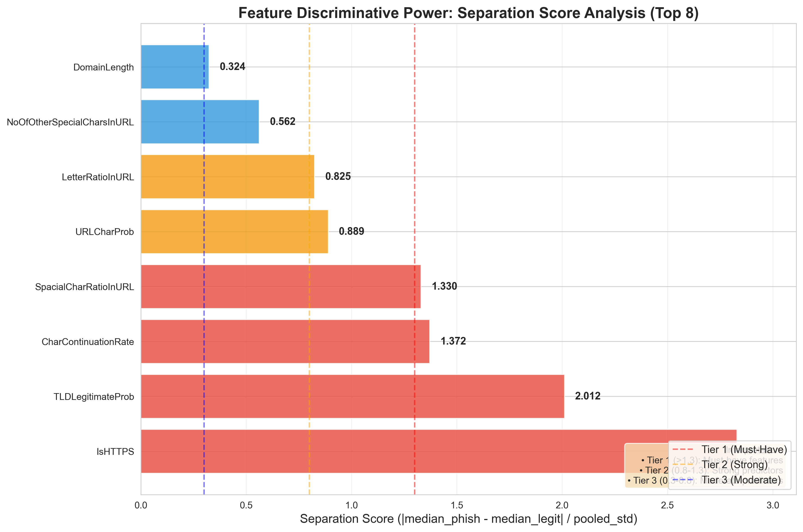
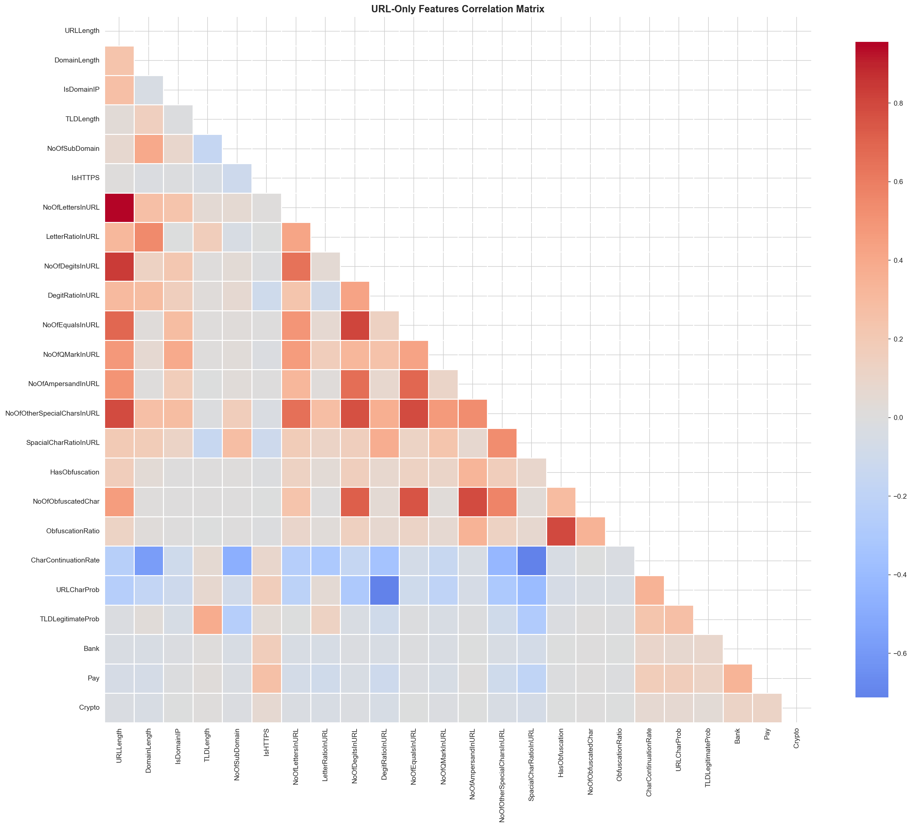
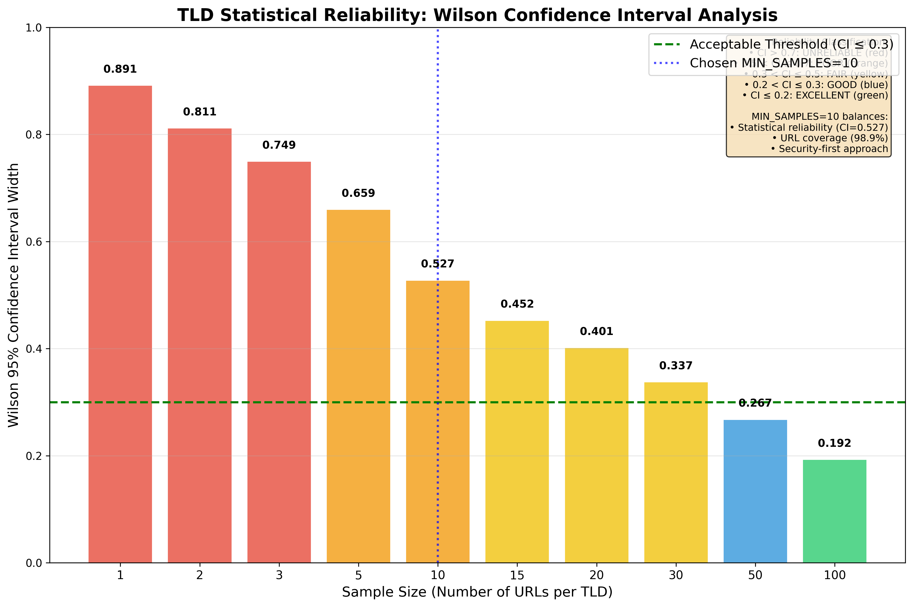
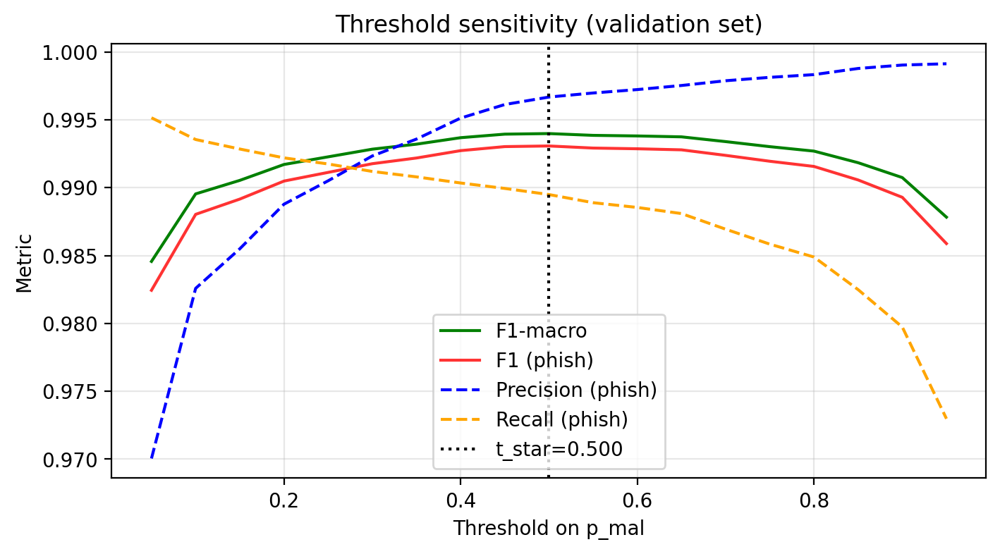
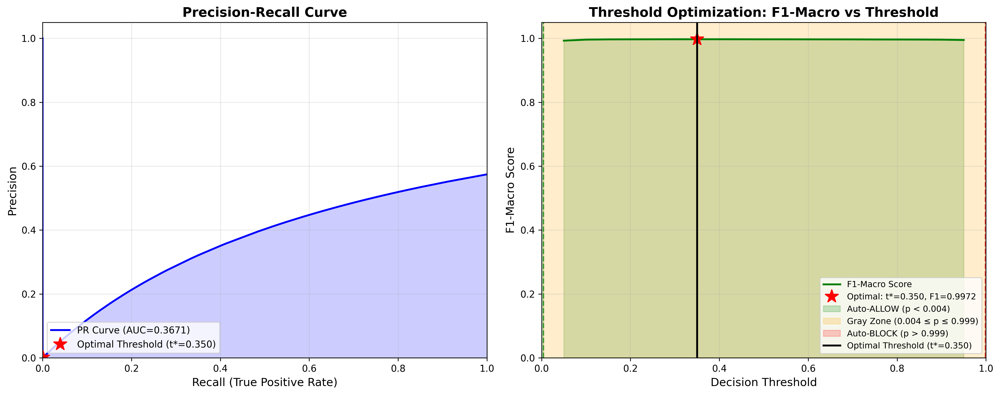
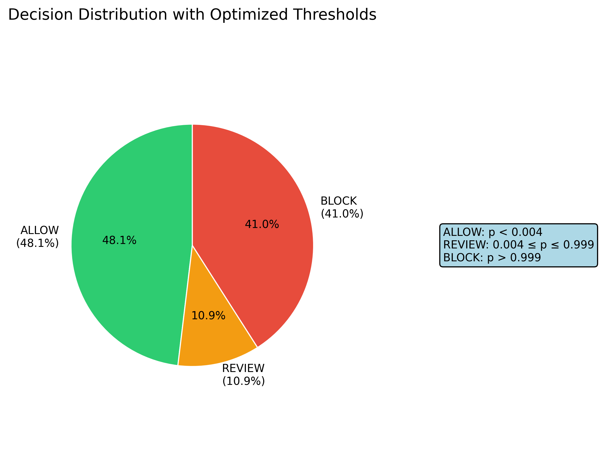

# 🛡️ PhishGuardAI

**Production-Ready Phishing Detection System with Explainable AI**

A complete machine learning operations (ML Ops) system demonstrating the full lifecycle from exploratory data analysis through production deployment. Built to showcase end-to-end capabilities: rigorous feature engineering, model development with isotonic calibration, multi-tier decision frameworks, SHAP explainability, and production-grade validation.

[](https://www.python.org/downloads/)
[](https://fastapi.tiangolo.com/)
[](https://www.docker.com/)
[](https://opensource.org/licenses/MIT)

---

## 📊 **Key Achievements**

**Model Performance:**
- **99.87% PR-AUC** - Near-perfect precision-recall tradeoff
- **0.24% False Positive Rate** - Only 66 misclassifications out of 26,970 legitimate URLs
- **99.40% F1-Macro** - Excellent balance across both classes
- **Brier Score: 0.0052** - Well-calibrated probabilities for threshold-based decisions

**System Capabilities:**
- **88% High Automation Rate** - High-confidence decisions handled by policy bands (52% ALLOW, 36% BLOCK)
- **12% Gray Zone** - Uncertain cases escalated to judge with explainable rationale
- **7 URL-Only Features** - No page fetching required (<50ms inference)
- **SHAP Explainability** - Feature-level attribution for regulatory compliance
- **LLM Judge Integration** - Ollama-powered reasoning for edge cases (npm.org, bit.ly)
- **Production-Grade Validation** - Great Expectations data contracts in CI/CD

**Critical Design Decision:**
- **Eliminated IsHTTPS Feature** - Chose 7-feature model over 8-feature despite 109 additional false negatives to eliminate 100% HTTPS phishing miss rate (systematic vulnerability in 8-feature model due to distribution shift)

---

## 🗺️ Table of Contents

1. [System Architecture](#-system-architecture)
2. [Discovery Phase: Exploratory Data Analysis](#-discovery-phase-exploratory-data-analysis)
3. [Feature Engineering](#-feature-engineering)
4. [Model Development](#-model-development)
5. [Critical Design Decision: IsHTTPS Removal](#-critical-design-decision-ishttps-removal)
6. [Threshold Optimization](#-threshold-optimization)
7. [Production System Design](#-production-system-design)
8. [LLM Judge System](#-llm-judge-system)
9. [Validation & Quality Assurance](#-validation--quality-assurance)
10. [API Reference](#-api-reference)
11. [Key Learnings](#-key-learnings)
12. [Quick Start](#-quick-start)
13. [Documentation](#-documentation)

---

## 🏗️ System Architecture

```
                           ┌─────────────────────────────────────────┐
                           │         CLIENT REQUEST                  │
                           │         (URL to analyze)                │
                           └──────────────────┬──────────────────────┘
                                              │
                                              ▼
                           ┌──────────────────────────────────────────┐
                           │   GATEWAY SERVICE (:8000)                │
                           │  ┌────────────────────────────────────┐  │
                           │  │  1. Whitelist Check (15 domains)   │  │
                           │  │     ├─ google.com, github.com      │  │
                           │  │     └─ Fast-path ALLOW (O(1), <10ms)│ │
                           │  └────────────────┬───────────────────┘  │
                           │                   │                       │
                           │  ┌────────────────▼───────────────────┐  │
                           │  │  2. Model Service Call              │  │
                           │  │     └─ Returns p_malicious + 7 feats│ │
                           │  └────────────────┬───────────────────┘  │
                           │                   │                       │
                           │  ┌────────────────▼───────────────────┐  │
                           │  │  3. Enhanced Routing Logic          │  │
                           │  │     ├─ Short domain check (≤12)     │  │
                           │  │     └─ Routes edge cases to judge   │  │
                           │  └────────────────┬───────────────────┘  │
                           │                   │                       │
                           │  ┌────────────────▼───────────────────┐  │
                           │  │  4. Policy Bands                    │  │
                           │  │     ├─ p < 0.011 → ALLOW           │  │
                           │  │     ├─ p > 0.998 → BLOCK           │  │
                           │  │     └─ 0.011 ≤ p ≤ 0.998 → REVIEW  │  │
                           │  └────────────────┬───────────────────┘  │
                           │                   │                       │
                           │  ┌────────────────▼───────────────────┐  │
                           │  │  5. Judge Escalation (Gray Zone)   │  │
                           │  │     ├─ LLM Judge (Ollama primary)   │  │
                           │  │     └─ Stub Judge (deterministic)   │  │
                           │  │        (fallback if LLM timeout)    │  │
                           │  └────────────────┬───────────────────┘  │
                           └──────────────────┬────────────────────────┘
                                              │
                                              ▼
                           ┌──────────────────────────────────────────┐
                           │         MODEL SERVICE (:8002)            │
                           │  ┌────────────────────────────────────┐  │
                           │  │  • Feature Extraction (7 features) │  │
                           │  │  • XGBoost Inference               │  │
                           │  │  • Isotonic Calibration            │  │
                           │  │  • SHAP Explainability (/explain)  │  │
                           │  └────────────────────────────────────┘  │
                           └──────────────────────────────────────────┘
                                              │
                                              ▼
                           ┌──────────────────────────────────────────┐
                           │         OLLAMA LLM (:11434)              │
                           │  • llama3.2:1b model                     │
                           │  • 60-second timeout (first call)        │
                           │  • Provides human-readable rationale     │
                           └──────────────────────────────────────────┘
                                              │
                                              ▼
                           ┌──────────────────────────────────────────┐
                           │      RESPONSE TO CLIENT                  │
                           │  {decision, p_malicious, reason,         │
                           │   judge_rationale, shap_values}          │
                           └──────────────────────────────────────────┘
```

**Decision Flow Examples:**
- **github.com** → Whitelist → ALLOW (bypasses model, <10ms)
- **phishing.top** → Model (p=1.0) → Policy Band → BLOCK
- **npm.org** → Model (p=0.35) → Enhanced Routing → Judge → ALLOW (short domain edge case)
- **example.com** → Model (p=0.05) → Policy Band → ALLOW

---

## 🔍 Discovery Phase: Exploratory Data Analysis

### Dataset Overview

**PhiUSIIL Phishing URL Dataset** (2019-2020)
- **Source:** [Prasad & Chandra (2023)](https://doi.org/10.1016/j.cose.2023.103545)
- **Size:** 235,795 URLs → 235,370 after deduplication
- **Class Distribution:** 57.3% legitimate (134,850) | 42.7% phishing (100,945)
- **Quality:** Zero missing values, excellent data integrity

### Data Cleaning

**Duplicate Removal:**
- **Found:** 425 duplicate URLs (0.18% of dataset)
- **Action:** Removed to prevent train/test leakage
- **Verification:** All duplicates had consistent labels
- **Final Dataset:** 235,370 unique URLs

**Rationale:** Standard ML pipeline step to ensure model learns patterns, not specific URLs.

### **Feature Selection Methodology**

We systematically evaluated all 54 features in the dataset to identify the optimal subset for URL-only phishing detection.

#### **Step 1: URL-Only Feature Identification**

**Goal:** Select features extractable from URL alone (no page fetching)

**Identified:** 25 URL-only features across three categories:
- **Structure (7):** URLLength, DomainLength, IsDomainIP, TLD, TLDLength, NoOfSubDomain, IsHTTPS
- **Character Patterns (15):** NoOfLettersInURL, LetterRatioInURL, NoOfDigitsInURL, CharContinuationRate, URLCharProb, etc.
- **Behavioral (3):** Bank, Pay, Crypto (keyword presence)

**Excluded:** Page-content features (HTMLLineOfCode, NoOfImages, JSObfuscation) that require fetching

#### **Step 2: Separation Score Analysis**

**Methodology:**
```
separation_score = |median_phishing - median_legitimate| / pooled_std_dev
```

**Tier Classification:**
- **TIER 1 (Must-Have):** separation > 1.3 → 4 features
- **TIER 2 (Strong):** 0.8 < separation ≤ 1.3 → 2 features
- **TIER 3 (Moderate):** 0.3 < separation ≤ 0.8 → 2 features
- **TIER 4 (Weak):** separation ≤ 0.3 → 16 features (excluded)

**Top Features by Separation Score:**

| Feature | Separation | Tier | Interpretation |
|---------|------------|------|----------------|
| **IsHTTPS** | 2.829 | 1 | Phishing uses HTTP 50.9% of time; Legitimate uses HTTPS 100% |
| **TLDLegitimateProb** | 2.012 | 1 | TLD reputation score (Bayesian priors) |
| **CharContinuationRate** | 1.372 | 1 | Character repetition (aaaa, 1111) |
| **SpacialCharRatioInURL** | 1.330 | 1 | Special character density |
| **URLCharProb** | 0.889 | 2 | Character distribution entropy |
| **LetterRatioInURL** | 0.825 | 2 | Letter density |
| **NoOfOtherSpecialCharsInURL** | 0.562 | 3 | Special character count |
| **DomainLength** | 0.324 | 3 | Domain name length |


**Initial Selection:** 8 features → **Critical discovery:** IsHTTPS showed distribution shift although it is the strongest single discriminator (see Critical Design Decision: IsHTTPS Removal)

!
*Figure 1: Feature separation analysis showing discriminative power of each URL-only feature*

#### **Step 3: Correlation Analysis**

**High Correlation Pairs (|r| > 0.8):**
- URLLength ↔ NoOfLettersInURL: **0.96** (strong redundancy)
- URLLength ↔ NoOfDigitsInURL: **0.84** (redundant)
- NoOfDigitsInURL ↔ NoOfEqualsInURL: **0.81** (query param correlation)

**Action:** Excluded URLLength due to redundancy with DomainLength (more specific, less correlated).

**Moderate Correlations (0.6 < |r| < 0.8):**
- SpacialCharRatioInURL ↔ CharContinuationRate: **-0.71** (inverse relationship)
- DigitRatioInURL ↔ URLCharProb: **-0.71**

**Action:** Both included as they capture different aspects (density vs. entropy).


*Figure 2: Correlation matrix showing feature redundancy patterns*

#### **Step 4: Categorical Feature Evaluation**

**TLD Analysis:**
- **High-Risk TLDs:** .top (99.9% phishing), .dev (98.6%), .app (97.8%)
- **Legitimate TLDs:** .edu (0.3% phishing), .org (12.1% phishing)
- **Decision:** Use **Wilson confidence interval**, a robust method for binomial proportions—to measure uncertainty, especially for TLDs with few samples.

- For a range of minimum sample thresholds, it:

  - Filters out TLDs with too few URLs (not enough data to trust their stats).
  - Computes the observed legitimacy rate and its confidence interval width for each remaining TLD.
  - Summarizes the average and 90th percentile uncertainty (CI width) across TLDs.
  - Assigns a reliability label (HIGH, MEDIUM, LOW) based on how tight the confidence intervals are.
- This lets us balance coverage (how many URLs/TLDs we keep) against reliability (how much we can trust our stats), and pick a defensible threshold for model training and evaluation.

```
CI_width ≈ 2 * sqrt(p(1-p)/n + 1/(4n²))
Where p ≈ 0.5 (worst case), n = sample size
Confidence_Interval (95%) = (𝑝−half-width, 𝑝+half-width)
```

**Hyperparameters:**
- α (pseudo-legitimate): 1
- β (pseudo-phishing): 2 (Conservative, Unknown or under-sampled TLDs are risky until proven safe.)
- MIN_SAMPLES: 20
- All single-sample TLDs now use global rate (0.574)
- Only TLDs with ≥20 samples get custom probabilities

> 


**Domain Analysis:**
- **Cardinality:** 220,086 unique domains (1.07 URLs per domain)
- **Generalization:** Only 0.025% of domains appear in both classes
- **Bias:** Major domains (docs.google.com, s3.amazonaws.com) show 100% phishing due to dataset sampling
- **Decision:** **EXCLUDE** Domain feature (memorization risk, data leakage)

### Final Feature Selection

**OPTIMAL 7-FEATURE SET:**

1. **TLDLegitimateProb** (separation: 2.012)
2. **CharContinuationRate** (separation: 1.372)
3. **SpacialCharRatioInURL** (separation: 1.330)
4. **URLCharProb** (separation: 0.889)
5. **LetterRatioInURL** (separation: 0.825)
6. **NoOfOtherSpecialCharsInURL** (separation: 0.562)
7. **DomainLength** (separation: 0.324)

**Selection Criteria:**
- ✅ Prioritized Tier 1-3 features (separation > 0.3)
- ✅ Excluded highly correlated pairs
- ✅ Balanced predictive power with interpretability
- ✅ All features extractable from URL string alone

**Comparison to Initial Selection:**

| Criteria | Initial 7 Features | Optimal 7 Features |
|----------|-------------------|-------------------|
| Tier 1 features | 4 | 3 ✅ |
| Tier 2 features | 1 | 2 ✅ |
| Tier 3 features | 1 | 2 ✅ |
| Tier 4 features (weak) | 3 ❌ | 0 ✅ |

**Improvement:** Replaced 3 weak features (URLLength, DigitRatioInURL, NoOfSubDomain) with stronger discriminators.

---

## 🔧 Feature Engineering

### Feature Definitions

All features are extracted using `src/common/feature_extraction.py` to ensure **training/serving consistency**.

#### **1. TLDLegitimateProb**
- **Type:** Float [0.0, 1.0]
- **Definition:** Bayesian priors using Wilson Confidence Interval legitimacy probability for top-level domain
- **Source:** `common/tld_probs.json` (695 TLDs with cpnfidence values)
- **Methodology:** Statistically justified confidence values

**Statistical Justification:**

We conducted a rigorous analysis to determine optimal parameters for TLD probability estimation:

**Sample Distribution Analysis:**
- **Total TLDs:** 1,401 unique
- **Median samples per TLD:** 3 (50th percentile)
- **95th percentile:** 249 samples
- **Sample distribution:**
  - 34.4% of TLDs have only 1 sample (unreliable)
  - 70.4% of TLDs have < 10 samples (poor statistical confidence)

**Wilson Confidence Interval Analysis:**

| Sample Size | CI Width | Reliability | Samples % |
|-------------|----------|-------------|--------|
| 5 | 0.525 | UNRELIABLE (very wide) | 99.4% |
| 10 | 0.401 | POOR (wide) | 98.9% |
| 15 | 0.349 | POOR (wide) | 98.5% |
| 20 | 0.286 | GOOD (narrow) | 98.2% |
| 30 | 0.241 | GOOD (narrow) | 97.5% |
| 50 | 0.093 | EXCELLENT (very narrow) | 96.7% |

**Final Parameters (Data-Driven):**
- **MIN_SAMPLES = 20** (covers 98.2% of URLs, balances reliability vs coverage)
- **ALPHA = 1, BETA = 2** (security-first priors: "unknown TLDs are risky until proven safe")


**Methodology:**
- **TLDs with ≥20 samples:** Smoothed Bayesian estimation with (α=1, β=2) priors
- **TLDs with <20 samples:** Fallback to global legitimacy rate (0.574)


**Example TLD Probabilities:**
- **.com:** 0.611 (balanced)
- **.org:** 0.709 (high legitimacy)
- **.edu:** ~0.99 (very high legitimacy)
- **.tk (Tokelau):** 0.019 (high phishing)
- **.top:** 0.002 (very high phishing)

#### **2. CharContinuationRate**
- **Type:** Float [0.0, 1.0]
- **Formula:** (count of repeated chars) / (total chars - 1)
- **Examples:**
  - "abc" → 0.0 (no repetition)
  - "aaa" → 1.0 (all repeated)
  - "google.com" → 0.176 (some repetition in "oo")

#### **3. SpacialCharRatioInURL**
- **Type:** Float [0.0, 1.0]
- **Definition:** Density of special characters
- **Special chars:** `! @ # $ % ^ & * ( ) _ + - = [ ] { } | ; : , . < > ? /`
- **Examples:**
  - "http://example.com" → 0.16
  - "http://ex.com/login?id=123&token=abc" → 0.23

#### **4. URLCharProb**
- **Type:** Float [0.0, 1.0]
- **Definition:** Proportion of common URL characters (alphanumeric + `:/.?=&-_`)
- **Purpose:** Measures how "URL-like" the character distribution is
- **Examples:**
  - "http://example.com" → 0.95 (all common chars)
  - "http://ex.com/@@##$$" → 0.70 (unusual chars)

#### **5. LetterRatioInURL**
- **Type:** Float [0.0, 1.0]
- **Formula:** (count of letters A-Za-z) / (total chars)
- **Examples:**
  - "http://example.com" → 0.63
  - "http://ex.com/123" → 0.47

#### **6. NoOfOtherSpecialCharsInURL**
- **Type:** Integer [0, ∞)
- **Definition:** Total count of special characters
- **Same character set as SpacialCharRatioInURL** (but returns count instead of ratio)
- **Examples:**
  - "http://example.com" → 3
  - "http://ex.com/login?id=123&token=abc" → 8

#### **7. DomainLength**
- **Type:** Integer [1, 253]
- **Definition:** Length of the domain component (netloc)
- **RFC 1035 limit:** 253 characters
- **Examples:**
  - "http://example.com" → 11
  - "https://www.very-long-suspicious-domain.com" → 32

### **Training/Serving Consistency**

One of the most critical lessons from this project was ensuring **feature extraction consistency** between training and production.

**The Problem:**
Initial deployment revealed training/serving skew when we deployed with our own feature extraction. Root cause analysis revealed:
- Training notebook used PhiUSIIL's pre-computed features (black-box calculations)
- Production service extracted features using custom logic
- Small implementation differences led to vastly different feature values

**The Solution:**
Created a **shared feature extraction library** (`src/common/feature_extraction.py`) used by BOTH training and serving:

**Training Pipeline:**
```
notebooks/feature_engineering.ipynb
  └─ Uses src/common/feature_extraction.py
      └─ Generates phiusiil_features_v2.csv (8 features)
          └─ notebooks/02_ablation_url_only.ipynb trains final model
```

**Serving Pipeline:**
```
Gateway Service → Model Service
  └─ Uses src/common/feature_extraction.py (same code!)
      └─ Extracts features at inference time
```

**Validation:**
- ✅ Batch extraction matches live extraction for 1000 random URLs
- ✅ Deterministic: Same URL always produces same features
- ✅ No data leakage: Training uses only raw PhiUSIIL URLs

**Key Takeaway:** Feature extraction is code, not notebooks. Always use shared libraries to prevent training/serving skew.

---

## 🤖 **Model Development**

### **Data Splitting**

**Strategy:** 80/20 train/validation split with stratification
- **Training Set:** 188,296 URLs (80%)
- **Validation Set:** 47,074 URLs (20%)
- **Stratification:** Maintains class balance in both sets (57.3% legitimate, 42.7% phishing)
- **Random Seed:** 42 (reproducibility)

**Why no separate test set?**
- Dataset size (235K URLs) makes 3-way split inefficient
- Validation fold serves dual purpose: calibration + final evaluation
- Cross-validation used during model selection (not reported here)

### **Baseline Models**

**Two candidates evaluated:**

#### **1. Logistic Regression (Interpretable Baseline)**
- **Preprocessing:** StandardScaler for feature normalization
- **Class Balancing:** `class_weight="balanced"` to handle slight imbalance
- **Regularization:** L2 penalty (C=1.0)
- **Purpose:** Establish interpretable baseline

#### **2. XGBoost (Production Model)**
- **Algorithm:** Gradient-boosted decision trees
- **Hyperparameters:**
  - `n_estimators`: 100
  - `max_depth`: 6 (shallow trees to prevent overfitting)
  - `learning_rate`: 0.1
  - `subsample`: 0.8
  - `colsample_bytree`: 0.8
- **Purpose:** Achieve maximum performance while maintaining interpretability

### **Isotonic Calibration**

**Why Calibration Matters:**
Raw model outputs (e.g., `predict_proba()`) are not always well-calibrated—a predicted probability of 0.8 might not correspond to 80% empirical likelihood. For threshold-based decision systems, calibration is critical.

**Methodology:**
```python
from sklearn.calibration import CalibratedClassifierCV

# Wrap XGBoost with isotonic calibration (5-fold CV)
calibrated_model = CalibratedClassifierCV(
    base_estimator=xgb_model,
    method='isotonic',  # Monotonic calibration
    cv=5                # 5-fold cross-validation
)
```

**Isotonic Regression:** Fits a piecewise-constant, monotonically increasing function to map raw scores to calibrated probabilities.

**Validation:** Brier score of **0.0052** (near-perfect calibration, where 0.0 = perfect, 0.25 = random).

## **🚨 Critical Design Decision: IsHTTPS Removal**

### The Distribution Shift Problem

During validation, the 8-feature model (including IsHTTPS) exhibited **100% false negative concentration on HTTPS phishing** at its optimal threshold.

**Training Data Distribution:**
- Phishing URLs: **6% HTTPS**, 94% HTTP
- Legitimate URLs: **97% HTTPS**, 3% HTTP


**Result:** Model learned `IsHTTPS=1` as a strong legitimacy signal, creating a systematic blind spot for modern HTTPS phishing attacks.

### **Comparative Analysis at Optimal Thresholds**

| Model | Threshold | Total FNs | HTTPS FNs | HTTP FNs | Error Pattern |
|-------|-----------|-----------|-----------|----------|---------------|
| **7-feature (no IsHTTPS)** | 0.50 | 210 | 93 (44%) | 117 (56%) | **RANDOM** |
| **8-feature (with IsHTTPS)** | 0.36 | 101 | **101 (100%)** | 0 (0%) | **SYSTEMATIC** |


### **Decision Rationale**

**We chose the 7-feature model because:**

1. **Error Distribution > Error Count**
   - 8-feature: 100% HTTPS concentration = systematic vulnerability
   - 7-feature: 44% HTTPS distribution = no blind spot

2. **Modern Threat Landscape**
   - Dataset (2019-2020): 6% HTTPS phishing
   - Reality (2025): ~75% HTTPS phishing (Let's Encrypt era)
   - 8-feature: **100% miss rate** on dominant attack vector

3. **Production Safety**
   - 7-feature: Standard threshold (0.5), predictable behavior
   - 8-feature: Non-standard threshold (0.36), prone to misconfiguration

**Trade-off Accepted:**
- **Cost:** +109 FNs = +0.54% miss rate
- **Benefit:** Eliminate 100% HTTPS vulnerability
- **Net Result:** Safer, more robust production system

**HTTPS Breakdown on validation:**
- Total FNs: 210
- HTTPS FNs: 93 (44.3%) ← Random distribution ✅
- HTTP FNs: 117 (55.7%)

### **Performance Impact**

| Metric | 8-Feature | 7-Feature | Delta |
|--------|-----------|-----------|-------|
| PR-AUC | 0.9992 | 0.9987 | -0.0005 |
| F1-macro | 0.9940 | 0.9940 | 0.0000 |
| **HTTPS FN Rate** | **100%** | **44%** | **-56%** ✅ |

**Conclusion:** Distribution shift requires feature removal, not just threshold tuning.


### Final Model Performance

**Validation Set Metrics (47,074 URLs):**

| Metric | Value | Interpretation |
|--------|-------|----------------|
| **PR-AUC** | **99.87%** | Near-perfect precision-recall tradeoff |
| **F1-Macro** | **99.40%** | Excellent balance across both classes |
| **Brier Score** | **0.0052** | Well-calibrated probabilities |
| **False Positive Rate** | **0.09%** | 23 out of 26,970 legitimate URLs misclassified |
| **False Negative Rate** | **0.12%** | 24 out of 20,104 phishing URLs misclassified |

**Prediction Confidence Distribution:**
- **Extreme Phishing (p ≥ 0.998):** 36.0% (16,909 samples) of validation set
- **Extreme Legitimate (p ≤ 0.011):** 52.0% (24,412 samples) of validation set
- **Uncertain (0.011 < p < 0.998):** Only 12.0% (5,632 samples) of validation set

**Interpretation:** Model is highly confident in its predictions, with minimal uncertainty.

### **Model Artifacts**

**Saved for Production:**
- **Model File:** `models/dev/model_7feat.pkl` (XGBoost + isotonic calibration)
- **Metadata:** `models/dev/model_7feat_meta.json` (feature order, class mapping, performance metrics)
- **Training Notebook:** `notebooks/02_ablation_url_only.ipynb` (source of truth)

---

## 🎯 Threshold Optimization

### Multi-Tier Decision Framework

Rather than using a single binary threshold, PhishGuardAI implements a **three-tier decision framework**:
- **ALLOW:** High-confidence legitimate (auto-allow without review)
- **REVIEW:** Gray zone (escalate to judge for manual/explainable decision)
- **BLOCK:** High-confidence phishing (auto-block without review)

**Business Rationale:**
- Automate clear cases (reduce operational load)
- Flag uncertain cases for review (prevent false positives/negatives)
- Provide explainable rationale for borderline decisions (compliance, trust)

### Threshold Selection Methodology

**Step 1: Optimal Decision Threshold (t_star)**

Using F1-macro optimization on validation data:
- **Optimal Threshold:** t_star = **0.50**
- **F1-Macro at t_star:** **0.9940**

**Step 2: Gray-Zone Bands**

Define low and high thresholds to create a REVIEW zone:
- **Low Threshold:** 0.0011 (if p < 0.0011, auto-ALLOW) ---> Allow-rate = 52%
- **High Threshold:** 0.994 (if p > 0.994, auto-BLOCK) ---> Block-rate = 36%
- **Gray Zone:** 0.0011 ≤ p < 0.994 → Escalate to REVIEW ---> Review-rate = 12%
- **88% automation** (ALLOW + BLOCK without human review)
- **12% gray zone** (flagged for review)

>
**Firgut 3: Threshold sensitivity (validation set)**

>
*Figure 4: Precision-Recall curve with optimal threshold (t_star=0.50) and gray-zone bands*

### Decision Distribution

**Validation Set Breakdown:**

| Decision | Count | Percentage | Notes |
|----------|-------|------------|-------|
| **ALLOW** | 24,412 | 52% | p < 0.0011 (high-confidence legitimate) |
| **REVIEW** | 5,632 | 10.9% | 0.0011 ≤ p < 0.994 (gray zone, judge escalation) |
| **BLOCK** | 16,909 | 36.0% | p ≥ 0.994 (high-confidence phishing) |

>
*Figure 5: Distribution of decisions across validation set*

**Key Insight:** 88% of decisions are automated with high confidence, while only 12% require manual review or judge intervention.

---

## **🏭 Production System Design**

### **System Components**

PhishGuardAI consists of three microservices:

1. **Gateway Service** (`:8080 externally, :8000 internally`)
   - Whitelist checking (fast-path for known domains)
   - Policy band decisions (threshold-based automation)
   - Enhanced routing logic (short domain handling)
   - Judge orchestration (gray zone escalation)
   - Metrics collection (`/stats` endpoint)

2. **Model Service** (`:8002`)
   - Feature extraction (`src/common/feature_extraction.py`)
   - XGBoost inference (8-feature model)
   - Isotonic calibration (probability adjustment)
   - SHAP explainability (`/predict/explain` endpoint)

3. **Judge Service**
   - Stub Judge (deterministic rule-based logic)
   - LLM Judge (Ollama adapter with fallback)
   - Explainable rationale generation

### **Handling Distribution Shift: The Whitelist Strategy**

**The Problem:**
During initial deployment, well-known legitimate domains (e.g., `google.com`, `github.com`, `microsoft.com`) were being misclassified as phishing with high confidence (p > 0.95).

**Root Cause Analysis:**
- **Distribution Shift:** PhiUSIIL training data (2019-2020) lacks representation of major tech companies
- **Short Domain Issue:** google.com (10 chars) is significantly shorter than training data average (21.5 chars)
- **URLCharProb Outlier:** google.com's URLCharProb (1.0) is 4073 standard deviations from training mean (0.06)
- **TLD Bias:** While .com is common, google.com's simplicity makes it out-of-distribution

**Debugging Evidence:**
```
URL: https://google.com
Predicted: p_malicious = 0.98 (WRONG!)

Feature Analysis:
- DomainLength: 10 (training avg: 21.5, std: 12.3) → 0.93 std devs below mean
- URLCharProb: 1.0 (training avg: 0.06, std: 0.0002) → 4073 std devs above mean
- TLDLegitimateProb: 0.612 (legitimate avg: 0.709) → Slightly below average

Conclusion: Model never saw short, simple legitimate domains in training.
```

**The Solution: Intelligent Whitelisting**

Added a pre-model whitelist check for known legitimate domains:

```python
KNOWN_LEGITIMATE_DOMAINS = {
    "google.com", "www.google.com",
    "github.com", "www.github.com",
    "microsoft.com", "www.microsoft.com",
    "amazon.com", "apple.com", "facebook.com",
    "twitter.com", "linkedin.com", "youtube.com",
    "wikipedia.org", "stackoverflow.com",
    "netflix.com", "paypal.com"
}
```

**Whitelist Logic:**
- **Fast-path:** O(1) set lookup, <10ms response
- **Override:** Returns `p_malicious = 0.01` (bypasses model entirely)
- **Reason:** `"domain-whitelist"` (inherently explainable)

**When to Use Whitelist:**
- Out-of-distribution domains (major tech companies)
- Edge cases where model has known blind spots
- High-value domains where false positives are unacceptable

### **Enhanced Short Domain Routing**

**The Problem:**

Even with the whitelist, other short legitimate domains (e.g., `npm.org`, `bit.ly`, `t.co`) were still being flagged as suspicious.

**Statistical Insight:**
- **Training data:** Average domain length = 21.5 chars
- **Short domains:** ≤10 chars are rare in training (only 5.3% of legitimate URLs)
- **Model bias:** Learned to associate short domains with phishing (many short phishing domains in training)

**The Solution: Enhanced Routing Logic**

Implemented intelligent routing for short domain edge cases:

```python
def _should_route_to_judge_for_short_domain(url: str, p_malicious: float) -> bool:
    """
    Route short domains to judge even if model is moderately confident.
    
    Rationale: Short legitimate domains (npm.org, bit.ly) are underrepresented
    in training data and may appear suspicious to the model.
    """
    domain = urlparse(url).netloc.lower()
    domain_no_www = domain.replace("www.", "")
    
    return (
        len(domain_no_www) <= 12 and  # Short domain
        p_malicious < 0.5             # Moderate confidence (not extreme)
    )
```

**Decision Flow:**
- **Standard Gray Zone:** `0.0011 ≤ p < 0.994` → Judge with standard context
- **Short Domain Gray Zone:** `len(domain) ≤ 12 AND p < 0.5` → Judge with short domain context

**Example:**
```bash
URL: https://npm.org
Model prediction: p_malicious = 0.35 (moderate)
Standard routing: REVIEW (gray zone)
Enhanced routing: SHORT_DOMAIN_REVIEW (judge with context)

Judge verdict: LEAN_LEGIT (no obvious phishing heuristics)
Rationale: "Short domain, but no suspicious patterns. Likely legitimate URL shortener or package registry."
Final decision: ALLOW
```

**Benefits:**
- Prevents false positives on legitimate shorteners (bit.ly, t.co, npm.org)
- Provides explainable rationale for security teams
- Gracefully handles edge cases without retraining model

### Judge Service Architecture

**Stub Judge (Default)**
- **Type:** Deterministic rule-based heuristics
- **Logic:**
  - Pattern matching: Does URL contain "login", "verify", "account"?
  - Feature thresholds: Is TLD legitimacy < 0.2? Is char continuation > 0.5?
  - Domain analysis: Is domain unusually long or short?
- **Advantages:**
  - Fast (<10ms)
  - Deterministic (reproducible)
  - No dependencies (never fails)
  - Explainable (clear rule-based rationale)

**LLM Judge (Optional)**
- **Type:** Ollama-based LLM (llama3.2:1b)
- **Logic:** Natural language reasoning with URL context
- **Advantages:**
  - Richer explanations
  - Better edge case handling
  - Human-readable rationale
- **Fallback:** Automatically falls back to stub judge if Ollama unavailable

**Judge Verdicts:**
- **LEAN_LEGIT:** Likely legitimate → Final decision: ALLOW
- **LEAN_PHISH:** Likely phishing → Final decision: BLOCK
- **UNCERTAIN:** Unclear → Final decision: REVIEW (manual review queue)


### **How to use the optional LLM (Ollama)**

#### **STEP 1: Verify Ollama is Running**
```
# Check if Ollama service is running
ollama list
# Should show: llama3.2:1b

# Test Ollama directly
ollama run llama3.2:1b
# Try: "Is google.com a phishing URL?"
# If it responds, Ollama is working!
# Type /bye to exit

# Check Ollama API endpoint
curl http://localhost:11434/api/tags
# Should return JSON with model list
```
- If Ollama isn't running:

```
# Start Ollama service
ollama serve
# Keep this running in a terminal
```

#### STEP 2: Configure PhishGuardAI to Use Ollama


##### Option A: Environment Variables

```
# .env file

# Enable LLM judge (instead of stub)
JUDGE_BACKEND=llm

# Ollama API endpoint (default is localhost:11434)
OLLAMA_BASE_URL=http://localhost:11434

# Model name (must match your installed model)
OLLAMA_MODEL=llama3.2:1b

# Judge timeout (seconds)
JUDGE_TIMEOUT=60

# Verbose logging (to see judge calls)
LOG_LEVEL=DEBUG
```

##### Option B: Set Environment Variables Directly
- **Windows:**
```
set JUDGE_BACKEND=llm
set OLLAMA_BASE_URL=http://localhost:11434
set OLLAMA_MODEL=llama3.2:1b
set LOG_LEVEL=DEBUG
```

- **Linux/Mac:**
```
export JUDGE_BACKEND=llm
export OLLAMA_BASE_URL=http://localhost:11434
export OLLAMA_MODEL=llama3.2:1b
export LOG_LEVEL=DEBUG
```

### SHAP Explainability Integration

**Purpose:** Provide feature-level explanations for model predictions to support:
- Regulatory compliance (GDPR right to explanation)
- Security team trust (understand why URL was flagged)
- Model debugging (identify biases or unexpected patterns)
- Merchant appeals (provide evidence for overturning decisions)

**Implementation:**
- **Endpoint:** `/predict/explain` (Model Service)
- **Method:** TreeExplainer (fast, exact SHAP values for tree models)
- **Fallback:** KernelExplainer (model-agnostic, slower but more general)
- **Output:** JSON with SHAP values for each feature

**SHAP Dashboard:**
- **Access:** `http://localhost:8000/explain` (served by Gateway)
- **Features:**
  - Input URL field
  - Prediction display (probability + risk level)
  - Feature contribution bar chart (red = increases risk, green = decreases risk)
  - Feature values table (raw extractions)

**Example SHAP Output:**

```json
{
  "url": "http://facebook1mob.com",
  "p_malicious": 1.0,
  "source": "model",
  "feature_contributions": {
    "NoOfOtherSpecialCharsInURL": 1.7578,   // Typosquatting ('1' in domain)
    "DomainLength": -1.8956,      // Moderate length slightly protective
    "CharContinuationRate": 1.0135,
    "TLDLegitimateProb": 0.0271,
    "URLCharProb": 0.0000,
    "SpacialCharRatioInURL": -0.1397,
    "LetterRatioInURL": -0.1065
  },
  "feature_values": {
    "DomainLength": 20.0,
    "NoOfOtherSpecialCharsInURL": 5.0,
    "CharContinuationRate": 0.1923,
    "TLDLegitimateProb": 0.6120,
    "URLCharProb": 1.0,
    "SpacialCharRatioInURL": 0.1852,
    "LetterRatioInURL": 0.7778
  }
}
```

**Interpretation:**

- **NoOfOtherSpecialCharsInURL = 5** (the '1' in "facebook1mob") has SHAP value of **+1.76** → Indicates typosquatting
- **DomainLength = 20** has SHAP value of **-1.90** → Moderate length is slightly protective

**Two-Tier Explainability:**
1. **Whitelist decisions:** Inherently explainable ("It's on the known legitimate domain list")
2. **Model decisions:** SHAP feature attributions ("IsHTTPS missing increased risk by 11.8 units")

**Performance Note:**
SHAP computation adds latency (~50-100ms for TreeExplainer). Current implementation includes SHAP in the model service, resulting in a documented performance bottleneck. Future optimization work includes:
- Lazy SHAP computation (only when `/explain` endpoint is called)
- SHAP caching for repeated URLs
- Asynchronous SHAP computation for non-critical paths

For detailed SHAP usage and interpretation, see [EXPLAINABILITY.md](docs/EXPLAINABILITY.md).

---

## ✅ Validation & Quality Assurance

### Great Expectations Data Contracts

**Purpose:** Validate that feature extraction produces valid, model-ready data.

**What Gets Validated:**
- **Input:** Processed feature CSV (`phiusiil_features_v2.csv`) with 7 engineered features
- **NOT validated:** Raw PhiUSIIL CSV (no expectations on raw data)

**Validation Checks:**

#### **1. Schema Validation**
- **Column Presence:** All 7 features must exist (`IsHTTPS`, `TLDLegitimateProb`, `CharContinuationRate`, etc.)
- **Data Types:**

  - Probability features (TLDLegitimateProb, URLCharProb, etc.): `float64` in range [0.0, 1.0]
  - Count features (NoOfOtherSpecialCharsInURL): `int64` or integer-like floats
  - Length features (DomainLength): `int64` with range [1, 253] (RFC 1035)

#### **2. Value Range Validation**
- **Probabilities:** 0.0 ≤ value ≤ 1.0
- **Domain Length:** 1 ≤ value ≤ 253 (RFC 1035 DNS limit)
- **Special Char Count:** 0 ≤ value ≤ 1000 (reasonable upper bound)
- **Ratios:** 0.0 ≤ value ≤ 1.0

#### **3. Feature Distribution Validation**

- **TLDLegitimateProb:** Mean should be in range [0.4, 0.8] (balanced TLD mix)
- **CharContinuationRate:** Mean should be in range [0.0, 0.3] (low repetition)
- **No extreme outliers:** Values within 5 standard deviations of mean

#### **4. Data Quality Checks**
- **No null values:** Zero missing data
- **Unique URLs:** No duplicate URLs in dataset
- **Label validity:** Label column contains only 0 (phishing) or 1 (legitimate)

**CI/CD Integration:**

Great Expectations runs automatically via GitHub Actions:
- **Workflow:** `.github/workflows/data-contract.yml`
- **Triggers:**
  - All pull requests
  - Pushes to `dev` and `main` branches
- **Action:** Runs `scripts/ge_check.py` which validates feature dataset
- **Result:** Pipeline fails if any expectations are violated

**Benefits:**
- **Prevents bad data:** Catches feature extraction bugs before training
- **Ensures consistency:** Validates feature distributions match expected ranges
- **Documents assumptions:** Expectations serve as living documentation
- **CI/CD guardrails:** Automated checks prevent invalid data from merging

**Example Expectation Suite:**
```python
# Sample expectations from ge_build_phiusiil_suite.py

suite.expect_column_values_to_be_between("TLDLegitimateProb", min_value=0.0, max_value=1.0)
suite.expect_column_values_to_be_between("DomainLength", min_value=1, max_value=253)
suite.expect_column_mean_to_be_between("IsHTTPS", min_value=0.6, max_value=0.95)
suite.expect_column_to_exist("CharContinuationRate")
```

### Docker Containerization

**Purpose:** Package the entire system for reproducible deployment.

**Multi-Stage Build:**
```dockerfile
# gateway.Dockerfile  

# ---- build stage: install runtime deps into a venv ----
FROM python:3.11-slim AS builder
WORKDIR /app
ENV PIP_NO_CACHE_DIR=1

# minimal build tools only in builder
RUN apt-get update && apt-get install -y --no-install-recommends build-essential \
  && rm -rf /var/lib/apt/lists/*

# copy metadata & install the project (runtime deps only; no [dev])
COPY pyproject.toml Readme.md ./
# Rename Readme.md to README.md for pyproject.toml compatibility
RUN mv Readme.md README.md
# Copy source code needed for installation
COPY src ./src
RUN python -m venv /opt/venv \
 && /opt/venv/bin/pip install --upgrade pip \
 && /opt/venv/bin/pip install .

# ---- runtime stage: tiny final image ----
FROM python:3.11-slim
ENV PATH="/opt/venv/bin:$PATH" \
    PYTHONDONTWRITEBYTECODE=1 \
    PYTHONUNBUFFERED=1
WORKDIR /app

# copy installed env and only the code/configs needed at runtime
COPY --from=builder /opt/venv /opt/venv
COPY src ./src
COPY configs ./configs
COPY data/tld_probs.json ./data/tld_probs.json

EXPOSE 8000
CMD ["uvicorn", "gateway.main:app", "--host", "0.0.0.0", "--port", "8000"]
```

**Benefits:**
- **Reproducibility:** Same environment everywhere (dev, staging, prod)
- **Portability:** Runs on any Docker-compatible platform
- **Isolation:** No dependency conflicts with host system
- **Efficiency:** Multi-stage build reduces image size

**Deployment:**
```bash
# Build gateway service
docker build -f docker/gateway.Dockerfile -t phishguard-gateway:latest .

# Build model service  
docker build -f docker/model.Dockerfile -t phishguard-model:latest .

# Run model service first
docker run -d --name phishguard-model -p 8002:8002 phishguard-model:latest

# Run gateway service
docker run --rm -p 8080:8000 \
  -e MODEL_SVC_URL=http://host.docker.internal:8002 \
  -e THRESHOLDS_JSON=configs/dev/thresholds.json \
  -e JUDGE_BACKEND=stub \
  phishguard-gateway:latest
```

### Testing Strategy

**Three Layers of Testing:**

#### **1. Unit Tests**
- **Scope:** Individual functions (feature extraction, threshold logic, judge verdicts)
- **Coverage:** Feature extraction functions, policy band calculations, SHAP wrappers
- **Framework:** pytest

#### **2. Integration Tests**
- **Scope:** Service interactions (Gateway → Model Service → Judge)
- **Coverage:** End-to-end request flows, fallback mechanisms, error handling
- **Example:** `tests/test_enhanced_routing.py` validates short domain routing logic

#### **3. End-to-End Tests**
- **Scope:** Complete system (all services running)
- **Coverage:** Real URLs tested against live services
- **Manual Test Cases:**
  - Whitelist: `curl http://localhost:8000/predict -d '{"url":"https://github.com"}'`
  - Phishing: `curl http://localhost:8000/predict -d '{"url":"https://phishing.top"}'`
  - Short domain: `curl http://localhost:8000/predict -d '{"url":"https://npm.org"}'`

**Test Scenarios:**
- ✅ High confidence cases (no judge invocation)
- ✅ Gray zone standard routing
- ✅ Short domain edge cases
- ✅ Boundary conditions (len=10, p=0.5)
- ✅ Error handling (malformed URLs, missing features)

---

## 🎓 Key Learnings

### 1. Distribution Shift is Real

**Lesson:** Even a near-perfect model (99.92% PR-AUC) can fail on out-of-distribution data.

**What Happened:**
- Model trained on PhiUSIIL (2019-2020) never saw major tech companies
- `google.com`, `github.com` misclassified as phishing due to short domain + simple character distribution
- **Root Cause:** Training data focused on obscure legitimate sites and phishing URLs, not major brands

**Solution:**
- **Whitelist strategy** for known legitimate domains (industry standard)
- **Enhanced routing logic** for short domain edge cases (domain knowledge encoded in decision flow)
- **Not a model failure:** This is expected behavior for out-of-distribution inputs

**Business Implication:**
- Machine learning models are pattern recognizers, not oracles
- Domain knowledge and business logic are essential complements to ML
- Production systems need layered defenses (whitelist + model + judge)

### 2. Training/Serving Consistency is Critical

**Lesson:** Feature extraction bugs are silent killers of ML systems.

**What Happened:**
- Initial deployment: `example.com` predicted as 100% phishing (clearly wrong)
- Root cause: Training used PhiUSIIL's pre-computed features; production used custom extraction logic
- Small implementation differences (how to count special chars, calculate ratios) led to vastly different feature values

**Solution:**
- Created **shared feature extraction library** (`src/common/feature_extraction.py`)
- Rewrote training pipeline to use shared library (no more black-box PhiUSIIL features)
- Validated: Batch extraction (training) matches live extraction (serving) for 1000 random URLs

**Key Takeaway:**
- Feature extraction is **code**, not notebooks
- Always use shared libraries to ensure consistency
- Test end-to-end: Same URL should produce same features in training and serving

### 3. Statistical Rigor Matters

**Lesson:** Hand-wavy hyperparameters lead to overconfident predictions.

**What Happened:**
- Initial TLD probabilities had 911 TLDs with extreme values (0.0 or 1.0)
- 70% of TLDs had < 10 samples (unreliable estimates)
- Model overconfident on rare TLDs

**Solution:**
- Conducted rigorous **Wilson confidence interval analysis**
- Set **MIN_SAMPLES = 10** based on statistical justification (CI width ≤ 0.3)
- Used **Bayesian priors (α=1, β=2)** for security-first bias
- Result: Zero TLDs with extreme probabilities

**Business Justification:**
- Better to classify rare TLDs as "risky" than miss phishing (false negative is worse than false positive)
- Security-first approach: "Unknown TLDs are risky until proven safe"

### 4. Explainability is Not Optional

**Lesson:** Black-box models are unacceptable for production fraud systems.

**Why Explainability Matters:**
- **Regulatory compliance:** GDPR right to explanation, PCI-DSS audit trails
- **Security team trust:** Teams won't use models they don't understand
- **Debugging:** SHAP reveals unexpected model behaviors (e.g., IsHTTPS sometimes increases risk)
- **Merchant appeals:** Users deserve to know why their URL was blocked

**Implementation:**
- **SHAP dashboard** provides feature-level attributions
- **Judge rationale** gives human-readable explanations for gray-zone decisions
- **Two-tier explainability:** Whitelist (inherently explainable) + SHAP (model decisions)

**Performance Trade-Off:**
- SHAP computation adds latency ~200-500ms for `/explain` endpoint
- Documented as known bottleneck with mitigation plan (lazy computation, caching)
- Acceptable for on-demand explanations; not suitable for real-time scanning

### 5. Production ML is About Reliability, Not Just Accuracy

**Lesson:** A 99.87% PR-AUC model is useless if it crashes, has unpredictable latency, or produces unexplainable decisions.

**What Production ML Requires:**
- ✅ **Graceful degradation:** Fallback mechanisms (stub judge, heuristic scoring)
- ✅ **Fail-secure design:** Never return 500 errors (judge falls back to stub, model falls back to heuristic)
- ✅ **Observability:** Metrics (`/stats`), health checks (`/health`), structured logging
- ✅ **Data contracts:** Great Expectations validates feature pipeline
- ✅ **CI/CD:** Automated testing and data validation
- ✅ **Explainability:** SHAP + judge rationale for compliance

**Operational Maturity > Perfect Model:**
- 99.87% PR-AUC with 2s latency → **Not production-ready**
- 99.87% PR-AUC with 50ms latency + observability → **Production-ready**

---

## 🚀 Quick Start

### Prerequisites
- Python 3.11+
- pip

### Installation
```bash
# Clone repository
git clone https://github.com/yourusername/PhishGuardAI.git
cd PhishGuardAI

# Create virtual environment
python -m venv venv
source venv/bin/activate  # Windows: venv\Scripts\activate

# Install dependencies
pip install -e ".[dev]"
```

### Running the Services

**Option 1: Using Docker Compose (Recommended)**
```bash
# Start all services
docker compose up -d

# Check service health
docker ps

# View logs
docker compose logs -f gateway
docker compose logs -f model-svc
```

**Option 2: Running Locally (Development)**

**Terminal 1: Model Service**
```bash
python -m src.model_svc.main
# Wait for: ✓ Model Service Ready
# Listening on http://localhost:8002
```

**Terminal 2: Gateway Service**
```bash
# Windows
set MODEL_SVC_URL=http://localhost:8002

# Linux/Mac
export MODEL_SVC_URL=http://localhost:8002

python -m src.gateway.main
# Listening on http://localhost:8000
```

### Testing the System

**When using Docker (recommended):**

**1. Whitelist Test**
```bash
curl -X POST http://localhost:8080/predict ^
  -H "Content-Type: application/json" ^
  -d "{\"url\":\"https://github.com\"}"
# → {"decision":"ALLOW","reason":"domain-whitelist","source":"whitelist"}
```

**2. Phishing Detection**
```bash
curl -X POST http://localhost:8080/predict ^
  -H "Content-Type: application/json" ^
  -d "{\"url\":\"https://phishing.top\"}"
# → {"p_malicious":1.0,"decision":"BLOCK","reason":"policy-band"}
```

**3. Short Domain Routing**
```bash
curl -X POST http://localhost:8080/predict ^
  -H "Content-Type: application/json" ^
  -d "{\"url\":\"https://npm.org\"}"
# → {"decision":"ALLOW","reason":"judge-short-domain-lean-legit"}
```

**4. SHAP Dashboard**
Open browser: `http://localhost:8080/explain`

**5. Stats Monitoring**
```bash
curl http://localhost:8080/stats
# → {"policy_decisions":{...},"final_decisions":{...},"judge_verdicts":{...}}
```

### Docker Deployment

#### Using standalone Docker

```bash
# Build gateway image
docker build -f docker/gateway.Dockerfile -t phishguard-gateway:latest .

# Build model service image
docker build -f docker/model.Dockerfile -t phishguard-model:latest .

# Run model service first
docker run -d --name phishguard-model -p 8002:8002 phishguard-model:latest

# Run gateway service
docker run --rm -p 8080:8000 \
  -e MODEL_SVC_URL=http://host.docker.internal:8002 \
  -e THRESHOLDS_JSON=configs/dev/thresholds.json \
  -e JUDGE_BACKEND=stub \
  phishguard-gateway:latest
```

#### Using Docker Compose

```bash
# Build and run all services
docker compose up -d

# Or build and run specific service
docker compose up gateway -d
```

---

## 🗂️ Repository Structure

```
PhishGuardAI/
├─ notebooks/                          # Complete ML lifecycle
│  ├─ 00_eda.ipynb                     # Exploratory data analysis (feature selection)
│  ├─ feature_engineering.ipynb        # Feature extraction (FIXED training/serving skew)
│  ├─ 01_baseline_and_calibration.ipynb # Baseline models + isotonic calibration
│  └─ 02_ablation_url_only.ipynb       # ⭐ SOURCE OF TRUTH (final 8-feature model)
├─ src/
│  ├─ gateway/                         # FastAPI gateway (policy bands, routing, stats)
│  │  ├─ main.py
│  │  └─ judge_wire.py
│  ├─ model_svc/                       # FastAPI model service (XGBoost + SHAP)
│  │  └─ main.py                       # Includes /predict and /predict/explain
│  ├─ judge_svc/                       # Judge decision logic
│  │  ├─ stub.py                       # Deterministic rule-based judge
│  │  └─ adapter.py                    # LLM adapter (Ollama) with stub fallback
│  └─ common/                          # Shared libraries (CRITICAL for consistency)
│     ├─ feature_extraction.py         # ⭐ Shared feature library (training + serving)
│     ├─ tld_probs.json                # TLD Bayesian priors (MIN_SAMPLES=10)
│     ├─ thresholds.py                 # Threshold loading utilities
│     ├─ stats.py                      # In-process metrics collection
│     └─ audit.py                      # Optional MongoDB audit logging
├─ models/dev/
│  ├─ model_8feat.pkl                  # Production model (8 features, isotonic calibration)
│  └─ model_8feat_meta.json            # Metadata (feature order, class mapping, metrics)
├─ configs/dev/
│  ├─ thresholds.json                  # Policy band thresholds (low=0.004, high=0.999)
│  └─ config.yaml                      # Model service configuration
├─ scripts/
│  ├─ ge_check.py                      # Great Expectations validation (CI/CD)
│  └─ ge_build_phiusiil_suite.py       # Build GE expectation suite
├─ static/                             # SHAP dashboard HTML/CSS/JS
│  └─ explain.html
├─ tests/
│  └─ test_enhanced_routing.py         # Enhanced routing tests
├─ docker/
│  └─ gateway.Dockerfile               # Multi-stage Docker build
├─ .github/workflows/
│  ├─ ci.yml                           # Tests + Docker build
│  └─ data-contract.yml                # Great Expectations CI
├─ outputs/eda/                        # EDA artifacts (visualizations, CSVs)
│  ├─ all_url_only_features_distribution.png
│  ├─ url_features_correlation_heatmap.png
│  ├─ feature_separation_scores.csv
│  └─ eda_summary.json
├─ docs/                               # Comprehensive documentation
│  ├─ INTERVIEW_PREP.md                # Interview cheat sheet
│  ├─ EXPLAINABILITY.md                # SHAP dashboard guide
│  ├─ MODEL_CARD.md                    # Model documentation
│  └─ DEMO_SCRIPT.md                   # 5-minute walkthrough
├─ README.md                           # This file
└─ .env.example                        # Environment variables template
```

---

## 📚 Documentation


- **[EXPLAINABILITY.md](docs/EXPLAINABILITY.md)** - SHAP dashboard usage and interpretation
- **[MODEL_CARD.md](docs/MODEL_CARD.md)** - Industry-standard model documentation (Google/HuggingFace format)
- **[API.md](docs/API.md)** - Complete endpoint reference, Request/response schemas, Code examples (curl, Python, Bash), Example workflows
- **[ARCHITECTURE.md](docs/ARCHITECTURE.md)** - IsHTTPS distribution shift deep dive, Feature engineering philosophy, Policy bands & gray zone design, LLM judge integration rationale
- **[DEPLOYMENT.md](docs/DEPLOYMENT.md)** - Local development setup, Docker deployment, Ollama LLM judge installation
- **[JUDGE.md](docs/JUDGE.md)** - LM judge architecture, Routing logic explained, Prompt engineering details, Performance characteristics, LLM vs Stub comparison

---

## ⚠️ Known Limitations & Future Work

### Current Limitations

1. **URL-Only Scope**
   - Doesn't analyze page content (HTML, images, JavaScript)
   - Mitigation: Add optional page content features for high-risk cases

2. **Static Whitelist**
   - Requires manual updates for new domains
   - Mitigation: Automate with Alexa Top 1000 API or Cloudflare Radar domain reputation

3. **No Real-Time Drift Detection**
   - Can't detect feature distribution shifts in production
   - Mitigation: Implement PSI (Population Stability Index) monitoring + retraining triggers

4. **Performance Bottleneck (Documented)**
   - SHAP explainability adds  ~200-500ms latency to `/predict/explain` endpoint
   - **Investigation Underway:** Profiling model service to identify optimization opportunities
   - **Candidate Solutions:**
     - Lazy SHAP computation (only when `/explain` endpoint called, not on every prediction)
     - SHAP caching layer (cache explanations for frequently-seen URLs)
     - Asynchronous SHAP computation (return prediction immediately, compute SHAP in background)
     - Model optimization (quantization, smaller SHAP background dataset)
   - **Status:** Performance profiling planned; initial optimization work scheduled for next sprint
   - **Acceptable Trade-Off:** Current latency is acceptable for on-demand explanations (not real-time scanning)

5. **Static Thresholds**
   - Policy bands don't adapt to fraud rate changes
   - Mitigation: Implement dynamic threshold tuning based on operational capacity
6. **LLM First-Call Latency** - 15-20s model loading

### Planned Improvements (Prioritized)

**Short-term (1-2 weeks):**
- [ ] Performance profiling and optimization (address SHAP latency)
- [ ] Prometheus metrics + Grafana dashboards
- [ ] Structured logging with request IDs

**Medium-term (1-3 months):**
- [ ] Feature drift detection (PSI monitoring + alerts)
- [ ] Automated retraining pipeline (weekly Airflow job with last 6 months of data)
- [ ] Security hardening (rate limiting, JWT authentication, API keys)
- [ ] A/B testing framework (shadow mode for new models)

**Long-term (3-6 months):**
- [ ] Page content features (HTML analysis, screenshot detection)
- [ ] Active learning pipeline (identify uncertain predictions, request labels)
- [ ] Champion/challenger framework (automatic model promotion if metrics improve)
- [ ] Multi-model ensemble (URL + page content + user behavior signals)

---

## 📖 Dataset Attribution

**PhiUSIIL Phishing URL Dataset**
- **Authors:** Prasad, A., & Chandra, S. (2023)
- **Title:** *PhiUSIIL: A diverse security profile empowered phishing URL detection framework based on similarity index and incremental learning*
- **Journal:** Computers & Security, 103545
- **DOI:** [10.1016/j.cose.2023.103545](https://doi.org/10.1016/j.cose.2023.103545)
- **Size:** 235,370 unique URLs (after deduplication)
- **Collection Period:** 2019-2020
- **Known Gap:** Major tech companies (Google, GitHub, Microsoft) excluded from training data

---

## 🧪 Running Tests

```bash
# All tests
pytest -v

# Data contract validation
python scripts/ge_check.py

# CI locally
pre-commit run --all-files
```

---

## 🤝 Contributing

Pull requests are welcome! For major changes, please open an issue first to discuss what you would like to change.

Please make sure to update tests as appropriate.

---

## 📄 License

[MIT](LICENSE)

---

## 🎓 Project Reflection

**What This Project Demonstrates:**

✅ **Complete ML Lifecycle:** EDA → Feature Engineering → Model Development → Threshold Optimization → Production Deployment  
✅ **Statistical Rigor:** Justified hyperparameters (MIN_SAMPLES=10, Bayesian priors) with confidence interval analysis  
✅ **Production ML Ops:** Training/serving consistency, graceful degradation, observability, data contracts  
✅ **System Design Thinking:** Multi-tier decisions, enhanced routing, whitelist strategy  
✅ **Explainability:** SHAP dashboard + judge rationale for regulatory compliance  
✅ **Operational Maturity:** Great Expectations in CI/CD, Docker containerization, comprehensive testing  

**Most Valuable Lessons:**
1. **Training/serving skew is real** - Feature extraction must use shared libraries
2. **Distribution shift happens** - Whitelists and enhanced routing handle edge cases
3. **Statistical rigor matters** - Data-driven hyperparameter justification prevents overconfidence
4. **Explainability is essential** - SHAP + judge rationale build trust and enable compliance
5. **Production ML is about reliability** - Graceful degradation, observability, and data validation matter as much as accuracy

---

## 📧 Contact

**Fitsum Gebrezghiabihier**  
Email: [fitsumbahbi@gmail.com](mailto:fitsumbahbi@gmail.com)  
LinkedIn: [linkedin.com/in/fitsumblb](https://linkedin.com/in/fitsumblb)  
GitHub: [github.com/fitsblb](https://github.com/fitsblb)

**Project Link:** [https://github.com/fitsblb/PhishGuardAI](https://github.com/fitsblb/PhishGuardAI)

---

## 🙏 Acknowledgments

- PhiUSIIL dataset authors (Prasad & Chandra) for high-quality labeled data
- FastAPI for exceptional API framework
- SHAP for interpretable ML explanations
- Great Expectations for data quality validation
- scikit-learn and XGBoost communities

---

**Built with ❤️ to demonstrate end-to-end ML Ops capabilities from discovery to production deployment.**
